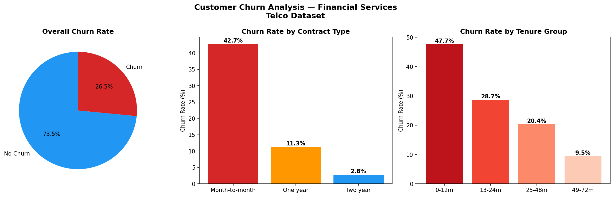
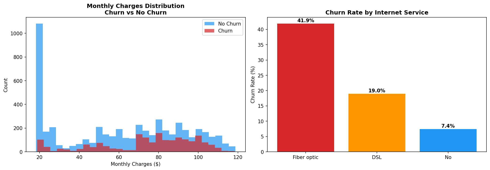
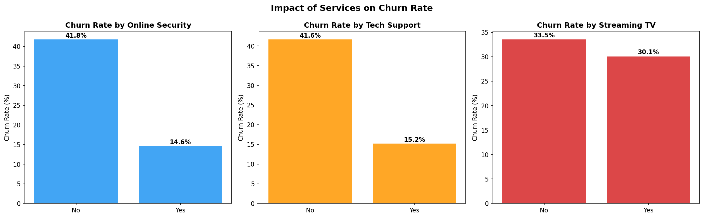
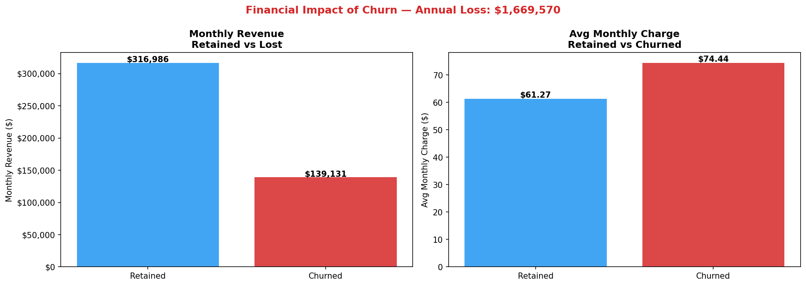
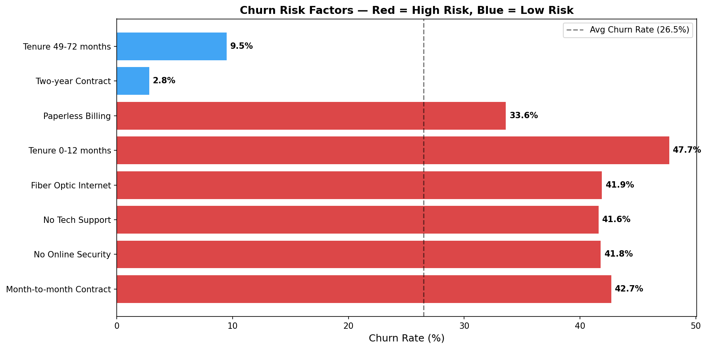
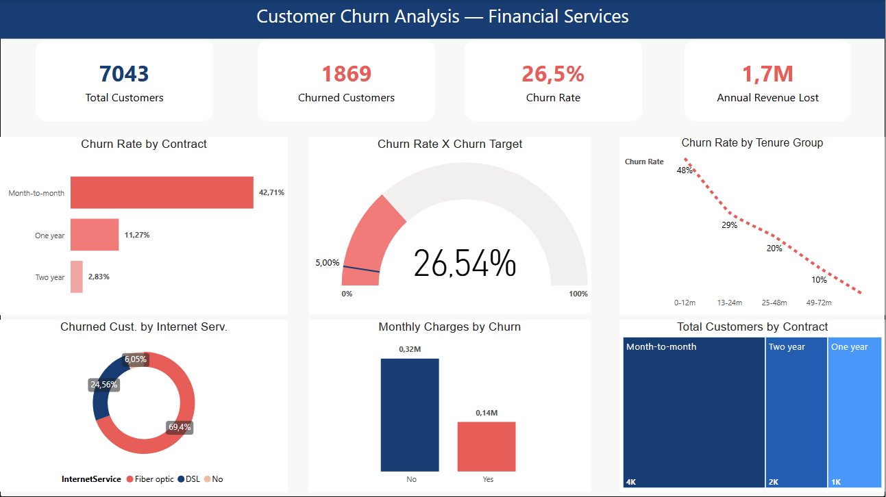

# Customer Churn Analysis
### Financial Services — Telco Dataset


---

## Problem Statement

A fictional financial services company is losing **26.5% of its customers annually**, 
representing **$1.67M in lost revenue**. This project analyzes 7,043 customer records 
to answer three core business questions:

1. Which customer profiles are most likely to churn?
2. Which services and contract types drive the highest churn risk?
3. What is the financial impact and how can it be reduced?

---

## Dataset

| Field | Detail |
|---|---|
| Source | [IBM Telco Customer Churn — Kaggle](https://www.kaggle.com/datasets/blastchar/telco-customer-churn) |
| Records | 7,043 customers |
| Features | 21 variables including demographics, services, contract type and charges |
| Target | Churn (Yes/No) |

---

## Tools Used

- **Python 3.13** — data processing and analysis
- **Pandas** — data manipulation and aggregation
- **Matplotlib / Seaborn** — data visualization
- **SQLite / DBeaver** — SQL query validation
- **Power BI Desktop** — executive dashboard
- **Jupyter Notebook** — exploratory analysis
- **Git / GitHub** — version control

>  All results were validated across both Python/Pandas and SQL/SQLite, 
confirming consistency in the analysis pipeline.

---

## Key Findings

### 1. Contract Type is the Strongest Churn Driver
- **Month-to-month contracts: 42.7% churn** vs 2.8% for two-year contracts
- Customers without long-term commitment are 15x more likely to churn

### 2. First 12 Months are Critical
- **47.7% churn rate** in the first year
- Drops to 9.5% after 4 years — loyalty increases significantly over time

### 3. Service Quality Drives Retention
- Customers **without Online Security: 41.8% churn** vs 14.6% with it
- Customers **without Tech Support: 41.6% churn** vs 15.2% with it
- Fiber optic customers churn at **41.9%** — highest among internet services

### 4. High-Risk Customer Profile
- Month-to-month contract + Fiber optic + No Online Security + No Tech Support
- **60.7% churn rate** — 925 out of 1,524 customers in this profile churned

### 5. Financial Impact
- **$1.67M annual revenue lost** to churn
- Churned customers pay **$74.44/month** vs $61.27 for retained — best customers leaving

---

## Business Recommendations

1. **Incentivize long-term contracts** — offer discounts for annual/biannual commitments
2. **Target new customers in first 12 months** — onboarding program to reduce early churn
3. **Bundle Online Security and Tech Support** — proactively offer to high-risk profiles
4. **Fiber optic retention campaign** — investigate service quality issues driving dissatisfaction

---

## Visualizations

### Churn Overview


### Churn by Charges and Internet Service


### Impact of Services on Churn


### Financial Impact


### Churn Risk Factors


### Executive Dashboard (Power BI)


---

## Repository Structure
```
customer-churn-analysis/
├── data/
│   ├── raw/                  # Original Telco dataset
│   └── processed/            # Cleaned data for Power BI
├── notebooks/
│   └── 01_exploratory_analysis.ipynb
├── sql/
│   └── analysis_queries.sql
├── dashboard/
│   └── churn_dashboard.pbix
├── docs/                     # Charts and visualizations
└── README.md
```

---

## About

Analysis developed by **Raiane Camara** as part of a Data Analytics portfolio.  
Background in healthcare operations, insurance, and financial services.

[](https://www.linkedin.com/in/raianecamara)